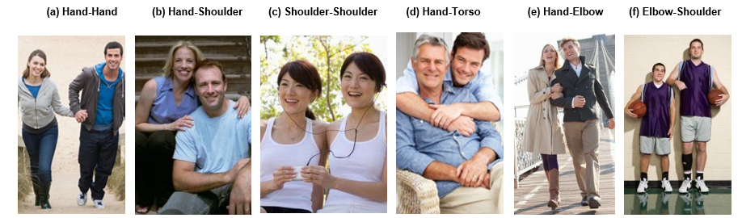
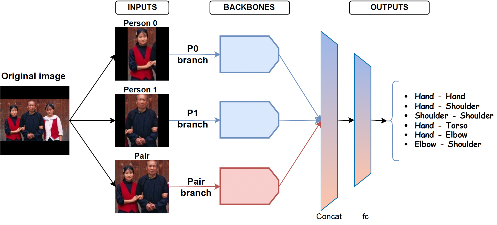

# Proxemics-Net: Automatic Proxemics Recognition in Images

| :page_facing_up: Paper                 |
| :--------------------------------------: |
| [Paper](https://link.springer.com/chapter/10.1007/978-3-031-36616-1_32) |

:page_facing_up: [Paper](https://link.springer.com/chapter/10.1007/978-3-031-36616-1_32)
[Demo](https://colab.research.google.com/drive/1ueD8UFvWvFYK-MFL-GO3gteqIAXaM2LT?usp=sharing) 


<p align="center">
    
</p>
<p align="center">
    <sub><strong>Figure 1: Touch codes in Proxemics.</strong> Images showing the six specific "touch codes" that were studied in this work.</sub>
</p>


Proxemics is a branch of anthropology that studies how humans use personal space as a means of nonverbal communication; that is, it studies how people interact. Due to the presence of physical contact between people, in the problem of proxemics recognition in images, we have to deal with occlusions and ambiguities, which complicates the process of recognition. Several papers have proposed different methods and models to solve this problem in recent years. Over the last few years, the rapid advancement of powerful Deep Learning techniques has resulted in novel methods and approaches. So, we propose Proxemics-Net, a new model that allows us to study the performance of two state-of-the-art deep learning architectures, ConvNeXt and Visual Transformers (as backbones) on the problem of classifying different types of proxemics on still images. Experiments on the existing Proxemics dataset show that these deep learning models do help favorably in the problem of proxemics recognition since we considerably outperformed the existing state of the art, with the ConvNeXt architecture being the best-performing backbone.


<p align="center">
    
</p>
<p align="center">
    <sub><strong>Figure 2: Our Proxemics-Net model.</strong> It consists of the individual branches of each person (`p0_branch` and `p1_branch`) (blue) and the `pair branch` (red) as input. All branches consist of the same type of backbone (ConvNeXt or ViT). The outputs of these 3 branches are merged in a concatenation layer and passed through a fully connected layer that predicts the proxemic classes of the input samples.</sub>
</p>


### :chart_with_upwards_trend: Comparison to the State of the Art
<div align="center">
  
  | Model                        | HH   | HS   | SS   | HT   | HE   | ES   | mAP (a) | mAP (b) |
  |------------------------------|------|------|------|------|------|------|---------|---------|
  | [Yang et al.](https://doi.org/10.1109/CVPR.2012.6248095)                  | 37   | 29   | 50   | 61   | 38   | 34   | 42      | 38      |
  | [Chu et al.](https://doi.org/10.1109/ICCV.2015.383)                  | 41.2 | 35.4 | 62.2 | -    | 43.9 | 55   | -       | 46.6    |
  | [Jiang et al.](https://doi.org/10.1109/CVPR.2017.366)                 | 59.7 | 52   | 53.9 | 33.2 | 36.1 | 36.2 | 45.2    | 47.5    |
  | Our ViT                      | 48.2 | 57.6 | 50.4 | 76.6 | 57.6 | 52.8 | 57.2    | 53.3    |
  | Our ConvNeXt_Base            | 56.9 | **53.4** | 61.4 | 83.4 | 68.7 | 58.8 | 63.8    | 59.8    |
  | Our ConvNeXt_Large           | **62.4** | 56.7 | **62.4** | **86.4** | **68.8** | **67.9** | **67.4**    | **63.8**    |
</div>


<p align="center">
<sub><strong>Table 1:</strong> Table compares our three best models concerning the existing state of the art.</sub>
</p>


In this Table, two values of %mAP are compared: mAP(a) is the value of mAP explained in the previous sections (the mean of the AP values of the six types of proxemics) and mAP(b) is the mean of the AP values but excluding the Hand-Torso (HT) class as done in Chu et al.

Looking at the table, we can see that our three proposed models (which use three branches as input) perform the best in both comparatives (mAP(a-b)), with the model that uses the ConvNeXt network as a backbone achieving the highest %mAP value (67.4% vs 47.5% mAP(a) and 63.8% vs 47.5% mAP(b)). Thus, we outperformed the existing state of the art by a significant margin, with improvements of up to 19.9% of %AP (mAP(a)) and 16.3% of %mAP (mAP(b)).

Therefore, these results demonstrate that the two state-of-the-art deep learning models (ConvNeXt and Vision Transformers) do help in the proxemics recognition problem since, using only RGB information, they can considerably improve the results obtained by all competing models.

---

## :rocket:What's new??

- `base_model_main/`: Main directory for the base model.
- `dataset/`: Directory containing the code necessary for dataset preprocessing.
- `ìmg/`: Directory containing the images of this work
- `test/`: Directory containing code and resources related to model testing.
- `train/`: Directory containing code and resources related to model training.
- `dataset_proxemics_IbPRIA.zip`: ZIP file containing the preprocessed dataset.
- `requirements.txt`: File specifying the necessary dependencies for the project.


## :star2:Quick Start
###  Installing Dependencies

To install the necessary dependencies to run this project, you can use the following command:

    conda create --name <env> --file requirements.txt

###  Unzipping the Preprocessed Dataset ZIP

To use the preprocessed dataset, you must first unzip the `dataset_proxemics_IbPRIA.zip` file and place it two directories above the current directory. You can use the following command:

    unzip dataset_proxemics_IbPRIA.zip -d ../

###  Downloading Pre-Trained Models

To use the pre-trained ConvNeXt models that we have selected as a backbone to train our Proxemics-Net models, you need to download them from the following locations:

- Pre-trained Base model: [Download here](https://dl.fbaipublicfiles.com/convnext/convnext_base_22k_224.pth) (350MB)
- Pre-trained Large model: [Download here](https://dl.fbaipublicfiles.com/convnext/convnext_large_22k_224.pth) (800MB)

Once downloaded, you need to unzip them and place them one level above, i.e., in ../premodels/.

###  Training a New Model

To train and test a new model, you should access the `base_model_main` directory and execute the following command lines based on the type of model you want to use:

- #### For Backbone Vit
  * Full Model (3 Branches)

         python3 base_model_main_ViT.py --datasetDIR <DIR dataset/> --outModelsDIR <DIR where you'll save the model> --b <batchsize> --set <set1/set2> --lr <learningRate>

  * Only Pair RGB
 
         python3 base_model_main_ViT.py --datasetDIR <DIR dataset/> --outModelsDIR <DIR where you'll save the model> --b <batchsize> --set <set1/set2> --lr <learningRate> --onlyPairRGB

- #### For Backbone ConvNeXt (Base or Large)

  * Full Model (3 Branches)
 
         python3 base_model_main_convNext.py --datasetDIR <DIR dataset/> --outModelsDIR <DIR where you'll save the model> --modeltype <base/large> --b <batchsize> --set <set1/set2> --lr <learningRate>

  * Only Pair RGB

         python3 base_model_main_convNext.py --datasetDIR <DIR dataset/> --outModelsDIR <DIR where you'll save the model> --modeltype <base/large> --b <batchsize> --set <set1/set2> --lr <learningRate> --onlyPairRGB


Be sure to adjust the values between <...> with the specific paths and configurations required for your project.

## :memo:Citing Proxemics-Net
If you find Proxemics-Net useful in your work, please consider citing the following BibTeX entry:
```bibtex
@InProceedings{jimenezVelasco2023,
   author = "Jiménez, I. and Muñoz, R. and Marín, M. J.",
   title = "Proxemics-Net: Automatic Proxemics Recognition in Images",
   booktitle = "Pattern Recogn. Image Anal.",
   year = "2023",
   pages = "402-413",
   note= "IbPRIA 2023",
   doi = "10.1007/978-3-031-36616-1_32"
}
